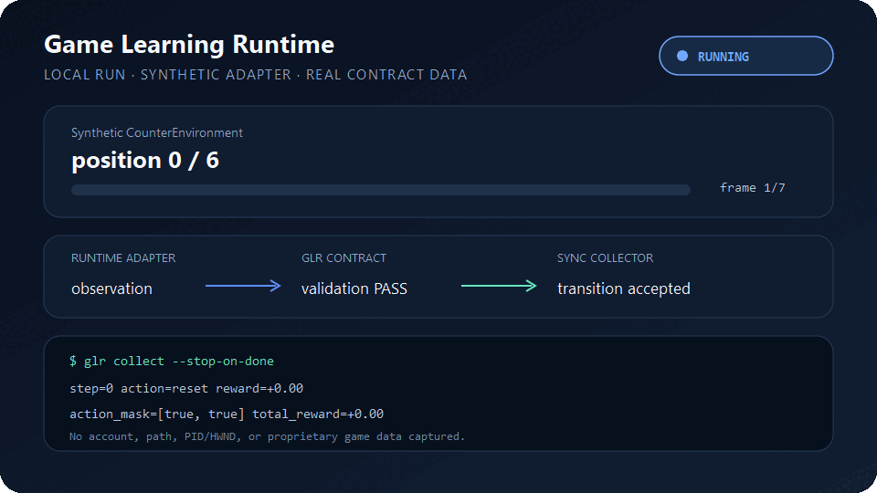

# Game Learning Runtime

English | [简体中文](README.zh-CN.md)

[](https://pypi.org/project/game-learning-runtime/)
[](https://github.com/loonghao/GameLearningRuntime/actions/workflows/ci.yml)
[](pyproject.toml)
[](LICENSE)

Game Learning Runtime (GLR) is a learner-neutral contract between game runtimes
and learning systems. Describe observations, actions, masks, rewards, events,
and episode boundaries once; reuse that adapter with TorchRL, custom PPO or
IMPALA, behavior cloning, offline datasets, evaluation, and automated QA.

> A universal runtime for connecting games to learning systems and AI agents.

GLR is for games and test environments you own or are authorized to instrument.
It does not include anti-cheat bypasses, stealth injection, or game-specific
reverse-engineering code.

## See GLR running



This GIF is generated from a real local `ContractEnvironment` + `SyncCollector`
run against GLR's explicitly synthetic counter adapter. It demonstrates the
public contract without exposing a game account, machine path, process/window
identity, or proprietary runtime data. See the [showcase provenance and capture
policy](docs/assets/showcase/README.md) before contributing footage from a live
adapter.

## One boundary, many consumers

```text
Game / simulator
      │
      ▼
Runtime adapter (C#, C++, Rust, Python, official API, ...)
      │
      ▼
GLR protocol + environment contract
      │
      ├── TorchRL
      ├── custom PPO / IMPALA
      ├── BC / DAgger / offline learning
      ├── recorder / replay
      └── evaluation / automated QA
```

Game adapters never import PPO, IMPALA, BC, or TorchRL. Learning code does not
need to know whether the runtime is Unity, Unreal, Source, native, or a test
simulator. GLR standardizes the data and lifecycle boundary, not one language,
engine, transport, or algorithm.

## What GLR standardizes

| Contract | Included today |
| --- | --- |
| Environment | `reset`, truthful live `attach`, `step`, `close`, termination, truncation, episode and step identity |
| Data | Recursive tensor specs, hybrid/parameterized actions, masks, events, rewards, immutable transitions |
| Bridge | Capability negotiation, reset/step fencing, metadata deny-by-default, transport-neutral driver ports |
| Training config | Strict `glr.training.v1` knowledge sources, lifecycle policy, bridge requirements, auditable weighted rewards |
| Collection | Fixed-length or terminal-bounded unrolls for PPO/IMPALA plus `glr.transition.v1` JSONL for BC/offline use |
| Integrations | Optional Gymnasium, TorchRL 0.13, and model-neutral PyTorch BC/PPO/GAE/V-trace objectives |
| Validation | Fail-closed contract wrapper and privacy-safe synthetic conformance profiles |
| Agent workflow | `glr-adapter-builder` Skill for provenance-first research, bridge scaffolding, rewards, and validation |

Game-specific adapters, concrete transports, generated C#/C++/Rust SDKs,
distributed actor transport, complete trainers, and reference models remain
[roadmap](docs/planning/roadmap.md) work.

## Quick start

Install the NumPy-only core:

```powershell
uv add game-learning-runtime
```

Choose optional integrations only where they are needed:

```powershell
uv add "game-learning-runtime[torchrl]"
uv add "game-learning-runtime[torch]"
uv add "game-learning-runtime[gymnasium,torchrl]"
```

Collect a learner-neutral unroll:

```python
from game_learning_runtime import ContractEnvironment, SyncCollector
from game_learning_runtime.examples import CounterEnvironment, always_increment

environment = ContractEnvironment(CounterEnvironment(target=3))
collector = SyncCollector(environment, actor_id="local-actor")
unroll = collector.collect(always_increment, steps=16, policy_version=0)

print(len(unroll.transitions), unroll.total_reward)
```

For an authorized already-running game, advertise `live-attach` and select that
lifecycle explicitly:

```python
environment = ContractEnvironment(authorized_live_adapter)
collector = SyncCollector(environment, start_mode="attach")
unroll = collector.collect(policy, steps=128, stop_on_done=True)
```

Attach starts a fresh logical GLR episode at step zero. It never claims that the
physical game world was reset or seeded.

## Knowledge and rewards as data

```python
from game_learning_runtime import RewardComposer, RewardSignal, load_training_config

config = load_training_config("training.json")
reward = RewardComposer(config).compose(
    [RewardSignal(name="progress", source="runtime", value=0.25)]
)
print(reward.total, reward.contributions)
```

Runtime telemetry should be `authoritative`; web guides and strategy priors
should be `advisory`. Reward terms require authoritative sources by default.
Configuration is data only: GLR does not evaluate reward expressions as code.

## Build an adapter with the Agent Skill

The repository-owned [glr-adapter-builder
Skill](.agents/skills/glr-adapter-builder/SKILL.md) gives a new agent a bounded
workflow for:

1. researching current game mechanics with source provenance;
2. separating physical `reset` from truthful live `attach`;
3. scaffolding a synthetic trainable seam;
4. defining knowledge and reward configuration;
5. implementing fenced observations/actions through a runtime bridge; and
6. validating conformance before a bounded authorized runtime trace.

The Skill never turns web strategy into runtime authority and never treats a
synthetic test as live-game acceptance.

## TorchRL and custom learners

Use the optional TorchRL adapter:

```python
from game_learning_runtime.examples import CounterEnvironment
from game_learning_runtime.integrations.torchrl import TorchRLEnvironment

env = TorchRLEnvironment(CounterEnvironment())
rollout = env.rollout(max_steps=32)
```

Or reuse the masked PPO objective in a custom PyTorch learner:

```python
from game_learning_runtime.integrations.torch_objectives import ppo_loss

terms = ppo_loss(
    policy_logits=logits,
    actions=actions,
    old_log_prob=old_log_prob,
    advantages=advantages,
    values=values,
    value_targets=value_targets,
    action_mask=action_mask,
)
terms.loss.backward()
```

## Reuse the CI workflow

Any uv-managed Python repository can call GLR's public reusable workflow:

```yaml
jobs:
  quality:
    uses: loonghao/GameLearningRuntime/.github/workflows/reusable-python-ci.yml@v0.2.0 # x-release-please-version
    with:
      python-versions: '["3.10", "3.12"]'
      sync-args: "--frozen --all-groups"
      lint-command: "uv run ruff check . && uv run mypy"
      test-command: "uv run pytest"
```

Pin a release tag or commit SHA in production. Release Please keeps the example
tag synchronized with package releases. The reusable workflow receives no
deployment secrets and only checks out and tests the calling repository.

## Releases

Conventional Commits on `main` create or update a Release Please pull request.
Merging that reviewed PR creates the tag and GitHub Release, verifies and builds
the tagged source, attaches provenance, and publishes the same distributions to
PyPI through Trusted Publishing. See the [release
runbook](docs/runbooks/release.md).

## Documentation

- [Getting started](docs/guides/getting-started.md)
- [Build a reusable runtime bridge](docs/guides/runtime-bridges.md)
- [Configure knowledge sources and rewards](docs/guides/knowledge-and-rewards.md)
- [Validate an adapter](docs/guides/adapter-conformance.md)
- [Adapt an existing Gymnasium environment](docs/guides/adapting-gymnasium.md)
- [Compose custom Torch objectives](docs/guides/using-torch-objectives.md)
- [Architecture](docs/architecture/overview.md) and [data flow](docs/architecture/data-flow.md)
- [Local development](docs/runbooks/local-development.md)
- [Benchmark baseline](docs/benchmarks/2026-08-31-data-plane-baseline.md)
- [Roadmap](docs/planning/roadmap.md) and [architecture decisions](docs/decisions/README.md)

See [CONTRIBUTING.md](CONTRIBUTING.md) for the development contract and
[SECURITY.md](SECURITY.md) for private vulnerability reporting. GLR is licensed
under the [MIT License](LICENSE).
